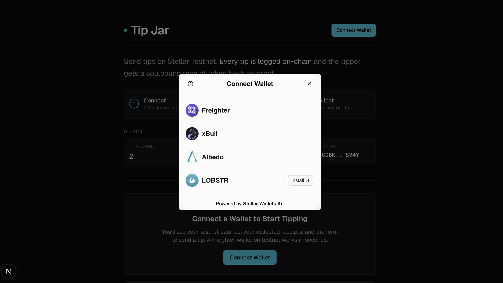
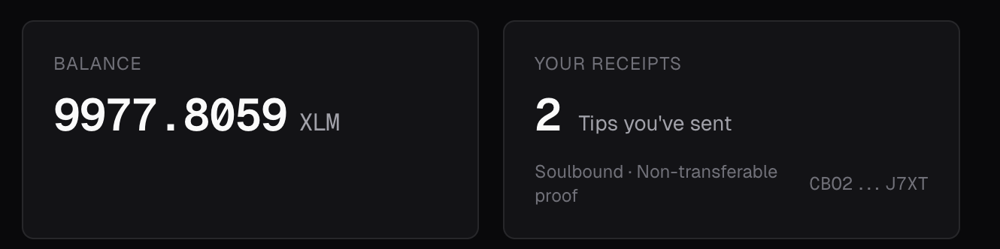
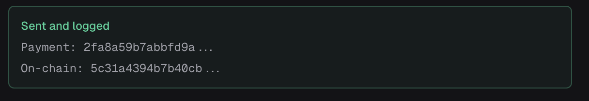
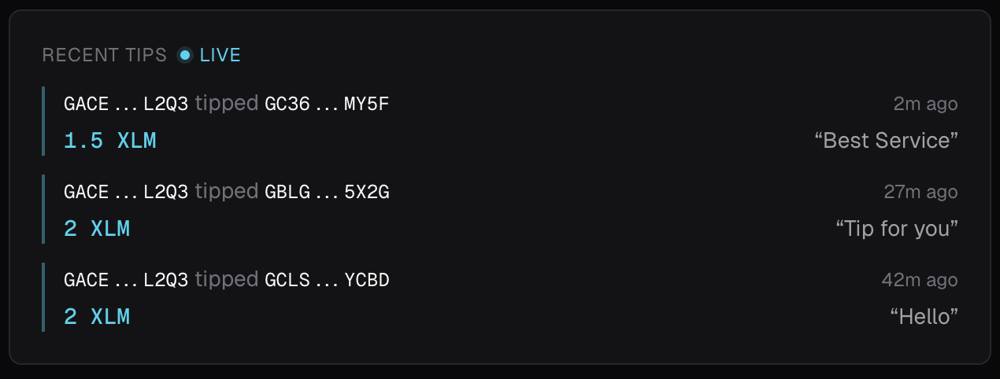
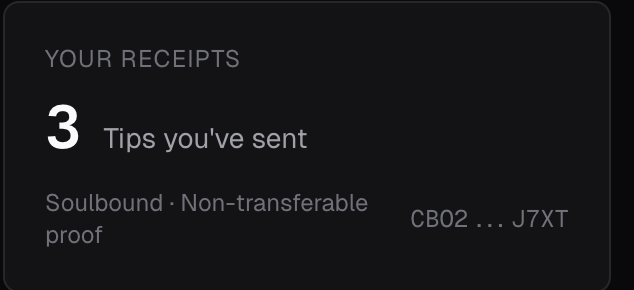
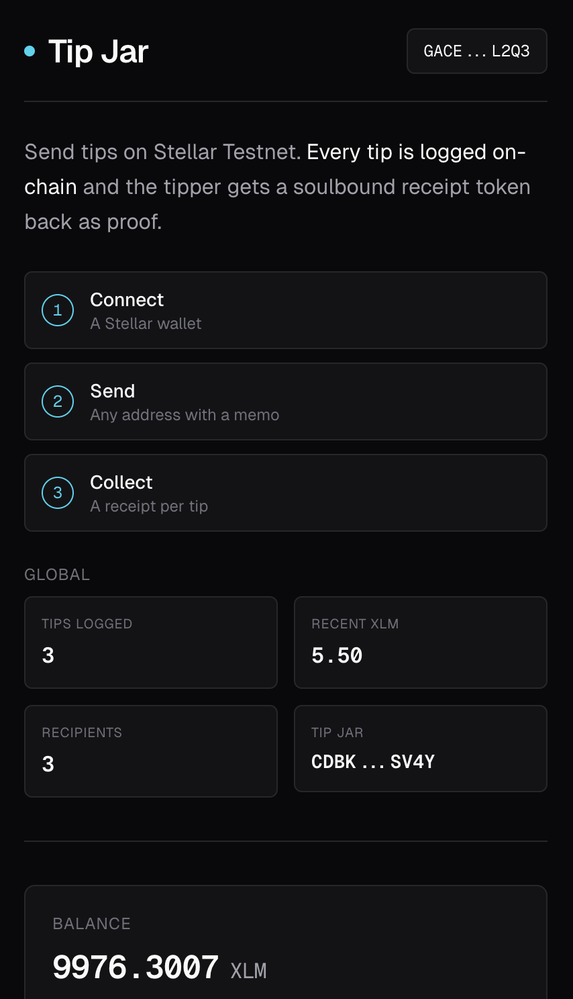
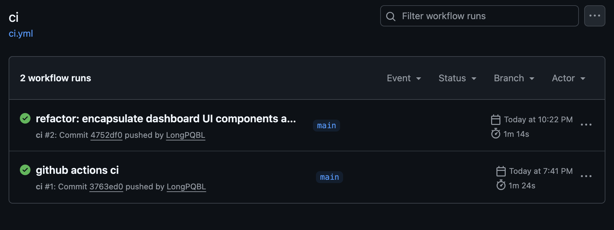
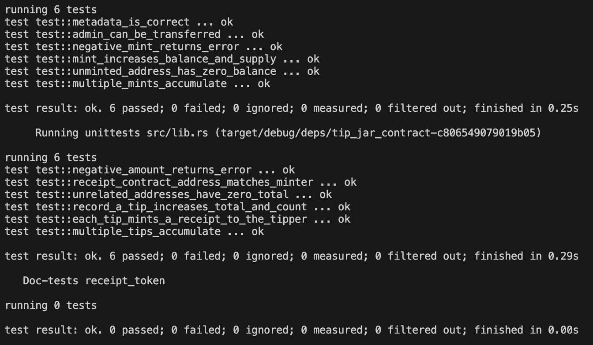

# Tip Jar

A small Stellar dApp on testnet for sending XLM tips. Connects a wallet (Freighter or anything else via Stellar Wallets Kit), sends the payment, records the tip on a Soroban contract, and mints a soulbound "receipt" token to the tipper as proof. Live feed of recent tips pulled straight from contract events.

[](https://github.com/LongPQBL/Tip-jar/actions)

- Live: <DEMO_URL>
- Demo video: <DEMO_VIDEO_URL>
- Tip Jar contract: [`CDBKD2U2…SV4Y`](https://stellar.expert/explorer/testnet/contract/CDBKD2U27Y73EI42LC6HMAS53PGVB6CUZK7DFPNWTOODSYOHD6L3SV4Y)
- Receipt contract: [`CBO2AVI6…J7XT`](https://stellar.expert/explorer/testnet/contract/CBO2AVI6YI5A27Z3A7WB36544DUM37SZ7QN3G6BMENJQY2YZ5DVVJ7XT)

## What's In Here

```
.
├── app/                 # Next.js App Router (page, layout, providers)
├── components/          # Wallet button, balance card, send form, event feed, receipts
├── hooks/               # React Query hooks (balance, send, events, receipts)
├── lib/
│   ├── stellar.ts       # Horizon client + send-XLM helper
│   ├── soroban.ts       # RPC client + invokeContract + ScVal helpers
│   ├── wallets.ts       # Stellar Wallets Kit init (4 wallets, lazy, browser-only)
│   ├── events.ts        # getEvents -> TipEvent[]
│   └── errors.ts        # WalletNotFound / UserRejected / InsufficientBalance
├── contract/
│   ├── Cargo.toml       # Workspace
│   ├── tip_jar/         # Records tips, calls receipt.mint, emits events
│   └── receipt/         # Soulbound SEP-41 receipt token
└── scripts/
    └── deploy.sh        # Build both, deploy, transfer admin, rewrite .env.local
```

## Stack

- Next.js 15 + React 19 + Tailwind v4 (dark fintech theme)
- @stellar/stellar-sdk (Horizon + Soroban RPC)
- @creit.tech/stellar-wallets-kit (Freighter, xBull, Lobstr, Albedo)
- soroban-sdk 22 (Rust)
- @tanstack/react-query (balance polling, event polling, caching, loading states)

## How It Works

Every "Send Tip" click does two on-chain things in sequence:

1. An XLM payment via Horizon. The recipient gets the funds.
2. A Soroban call to `tip_jar.record_tip(from, to, amount, memo)`. That function:
   - Bumps per-recipient totals + count in the tip_jar contract
   - Calls `receipt.mint(from, 1)` (inter-contract call) to drop a soulbound receipt token into the tipper's account
   - Emits a `tip` event with `(from, to, amount, memo)` so the live feed picks it up

The receipt token is non-transferable on purpose: there's nothing to redeem with it, it's just proof you tipped. Open the page in two browsers and a tip from one shows up in the other within ~6 seconds.

```
       Wallet
         │
   sign  │  payment + record_tip
         ▼
   ┌─────────────────────────┐         ┌──────────────────┐
   │      tip_jar            │ ──────► │ Receipt token    │
   │  - record_tip()         │  mint() │  - mint(to, 1)   │
   │  - total_tipped(addr)   │         │  - balance(addr) │
   │  - tip_count(addr)      │         │  (soulbound)     │
   │  - emits 'tip' event    │         └──────────────────┘
   └─────────────────────────┘
              │
              ▼
        Soroban RPC
              │
              ▼
   getEvents → live feed in UI
```

## Try It Locally

You'll need:

- Node 22+
- Rust stable + the Stellar CLI (`stellar` v25+, `wasm32v1-none` target installed)
- A Stellar testnet wallet ([Freighter](https://www.freighter.app/) is fine; Lobstr / Albedo / xBull all work via the kit)
- A funded testnet account (Freighter has a one-click Friendbot)

```bash
git clone https://github.com/LongPQBL/Tip-jar.git
cd Tip-jar
npm install
cp .env.example .env.local
# Already has the deployed contract IDs; works as is
npm run dev
```

Then open http://localhost:3000, hit "Connect Wallet", pick Freighter, send yourself a tip.

## Deploying Your Own Contracts

If you want fresh contracts under your own admin key:

```bash
stellar keys generate alice --network testnet --fund   # If you don't have a key
./scripts/deploy.sh alice
```

What the script does:

1. Builds both wasms (`stellar contract build` per crate)
2. Deploys receipt with the deployer as initial admin
3. Deploys tip_jar pointing at receipt
4. Calls `receipt.set_admin(tip_jar_address)` so future mints are authorized
5. Rewrites `NEXT_PUBLIC_TIP_JAR_CONTRACT_ID` and `NEXT_PUBLIC_RECEIPT_CONTRACT_ID` in `.env.local`
6. Prints stellar.expert links to both contracts

## Tests

```bash
cargo test
```

12 tests across both contracts:

**tip_jar** (6)

- `record_a_tip_increases_total_and_count`
- `each_tip_mints_a_receipt_to_the_tipper` (verifies the inter-contract call)
- `multiple_tips_accumulate`
- `negative_amount_returns_error`
- `unrelated_addresses_have_zero_total`
- `receipt_contract_address_matches_minter`

**receipt** (6)

- `mint_increases_balance_and_supply`
- `multiple_mints_accumulate`
- `negative_mint_returns_error`
- `unminted_address_has_zero_balance`
- `metadata_is_correct`
- `admin_can_be_transferred`

CI runs them on every push (see `.github/workflows/ci.yml`).

## Error Handling

Three typed errors in `lib/errors.ts` cover the failure modes the wallet kit + Horizon throw at us:

- `WalletNotFoundError` — No extension, no kit-supported wallet
- `UserRejectedError` — User closed the popup
- `InsufficientBalanceError` — op_underfunded / not enough XLM

`toError(e)` inspects raw thrown values and maps them. The send form switches on `instanceof` to render a friendly message instead of a stack trace.

## Screenshots

| | |
|---|---|
| Wallet picker |  |
| Balance loaded |  |
| Sent (payment + on-chain log) |  |
| Live tip feed |  |
| Receipts panel |  |
| Mobile view |  |
| CI passing |  |
| Cargo test output |  |

## Notes

- Amounts on the contract are i128 stroops. The frontend converts via `xlmToStroops("1.5")` so there's no float drift.
- The tip_jar contract doesn't move the XLM; the payment goes through a regular Horizon op. The contract is the on-chain ledger of "who tipped whom, how much, with what memo" plus the inter-contract mint. Simpler than wiring SAC transfers, and arguably more honest about what's happening.
- If the second signature is rejected after the payment goes through, the form surfaces both the payment hash and the failure so you can verify funds.
- Receipts are soulbound (no transfer function on the receipt contract) because they're just proof, not an asset.
